<h1 align="center"> Memobanking </h1>

  <a href="#💡-purpose">Purpose</a> •
  <a href="#⚙️-functionality">Functionality</a> •
  <a href="#🎯-target-audience">Target Audience</a> •
  <a href="#️🏛️-application-architecture-design">App Architecture Design</a> •
  <a href="#📡-dataflow-diagram">Dataflow Diagram</a> •
  <a href="#🎨-wireframes">Wireframes</a> •
  <a href="#📚-tech-stack">Tech Stack</a> •
  <a href="#📝-project-development-log">Project Development Log</a> •
  <a href="#💎-application-testing">Application Testing</a> •

## 🚀 Purpose

In today's fast-paced, digitalised world, mental health has become more crucial than ever. Young people, in particular, are facing unprecedented levels of stress, anxiety, and depression. The pressures of social media, academic demands, and societal expectations have contributed to a growing mental health crisis among the youth. 

By providing a structured way to track and understand emotions, Memobanking aims to be a proactive platform in addressing these issues. It encourages self-awareness and emotional regulation, key components in maintaining mental health and preventing the escalation of mental illnesses. Whether for personal growth or mental health management, Memobanking offers users valuable tools to navigate and understand one’s emotional landscape.  Through personalised insights and the ability to share experiences, Memobanking not only aids individual users but also fosters a broader conversation about mental health, promoting understanding and support within the community.

## ⚙️ Functionality

1. **Emotion Logging**
    
    Users can log their emotions by selecting from categories like Joy, Anger, Sadness, Fear, and Disgust. They have the option to write a brief note or reason for their emotion.

2. **Emotion History Log**
    
    Users can reflect back on their past emotion entries through a history log. Their emotion enteries can be categorised and filtered by date and emotion type for easy tracking and analysis.

3. **Graphical Data Visualisation**
    
    Users can track their emotional trends over time using graphs, identifying patterns and fluctuations.

4. **User Profiles**

    Users can choose to share their emotion history log and graphs publicly. They have options to control over what information is shared, such as hiding or showing reasons behind their emotions.
 

## 🎯 Target Audience

1. **Individuals with Mental Health Concerns**

    People dealing with anxiety, depression, or other mental health issues would find the app valuable for understanding their emotion patterns and indentifying potential triggers. 

2. **Therapy Clients**

    People who are already seeing therapists or counselors can use the app to track their progress and share data with their mental health professionals.

2. **Social Media Users**

    People who are active on social media might enjoy the feature that allows them to share their emotional data publicly, adding a personal and reflective aspect to their online presence.

### Personas & User Stories
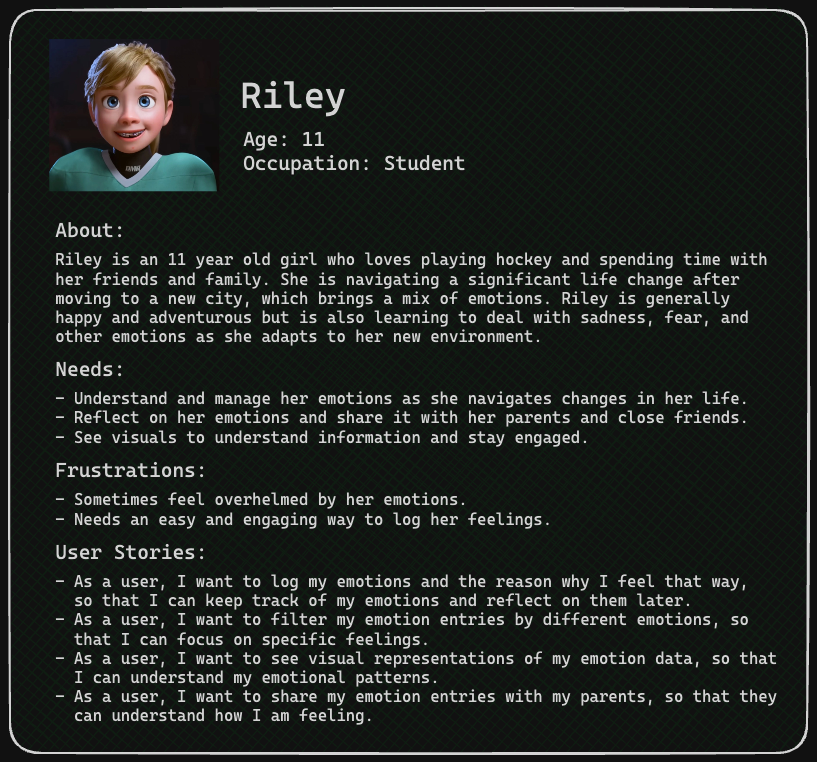

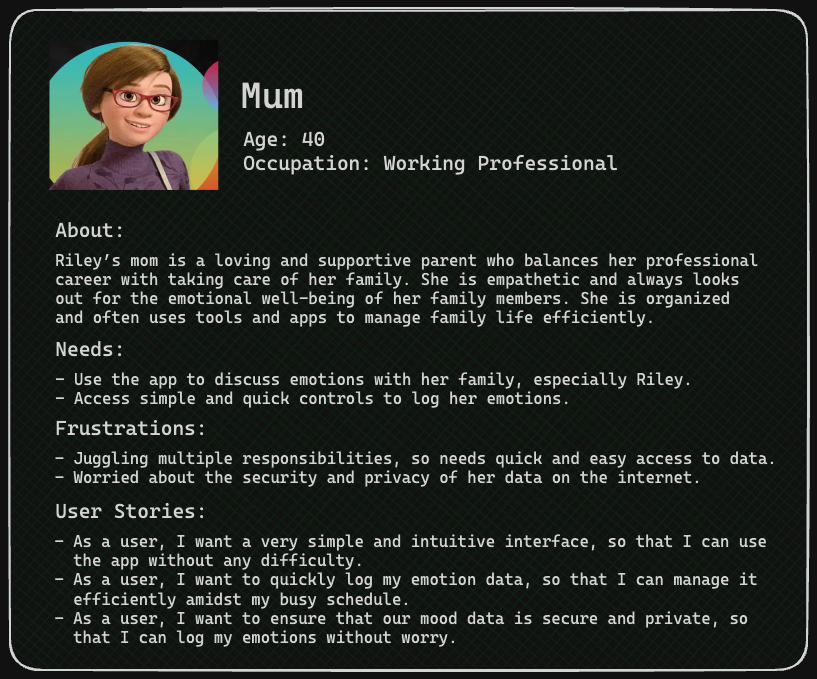

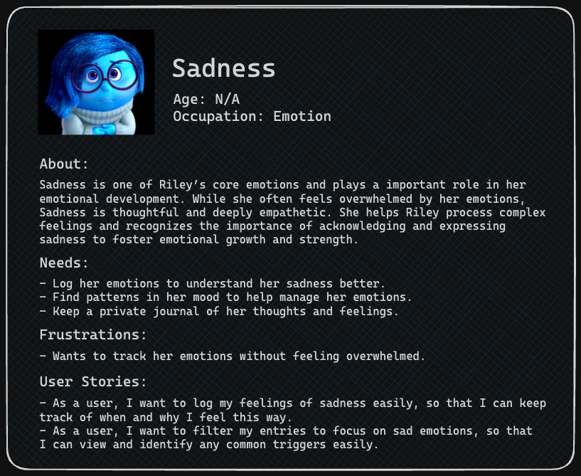

**Revision**
21-07-2024: 

- As a user, I want to create an account, so I can save my emotion entries and customise my experience on the platform.
- As a user, I want to log in to my account, so I can access my emotion entries and features.

## 🏛️ Application Architecture Design

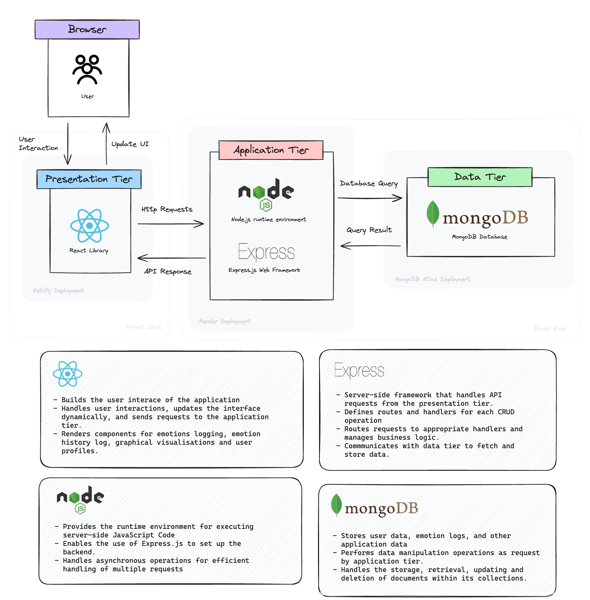

## 📡 Dataflow Diagram

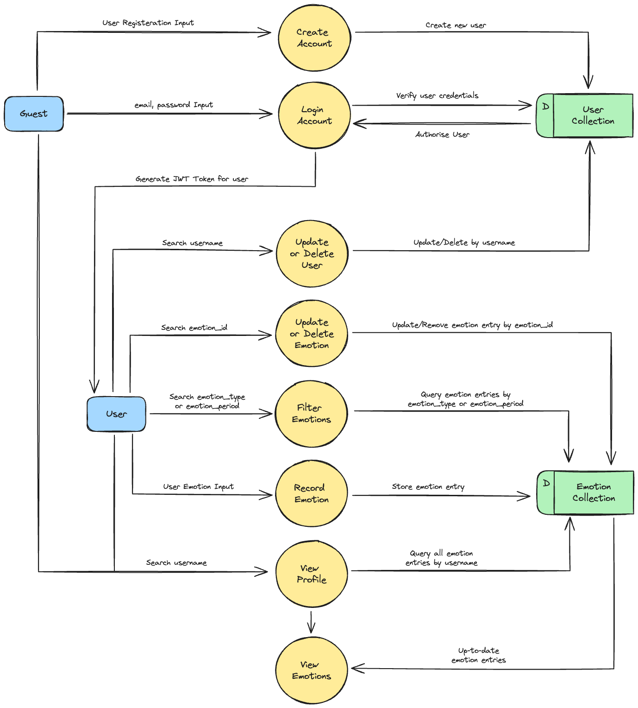

## 🎨 Wireframes

**Brainstorm:**

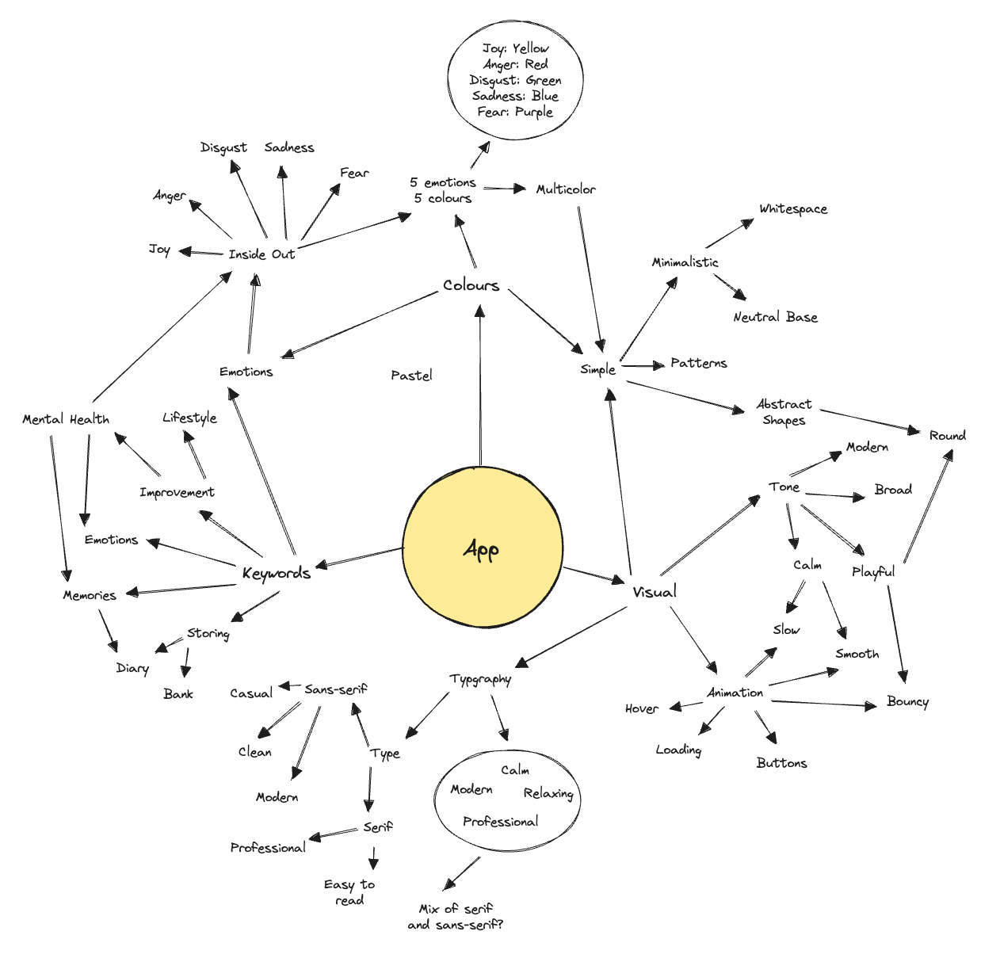

**Logo Design:**

**Sitemap:**

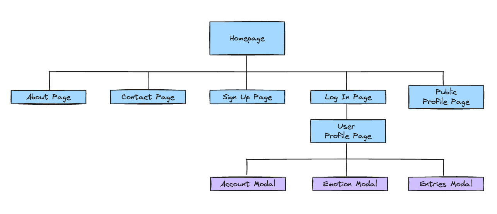

**Homepage:**

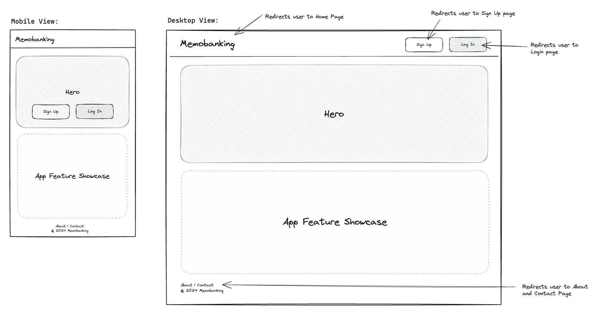

**Sign Up Page:**

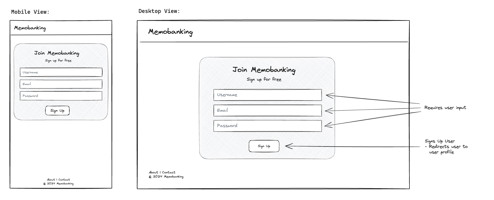

**Login Up Page:**

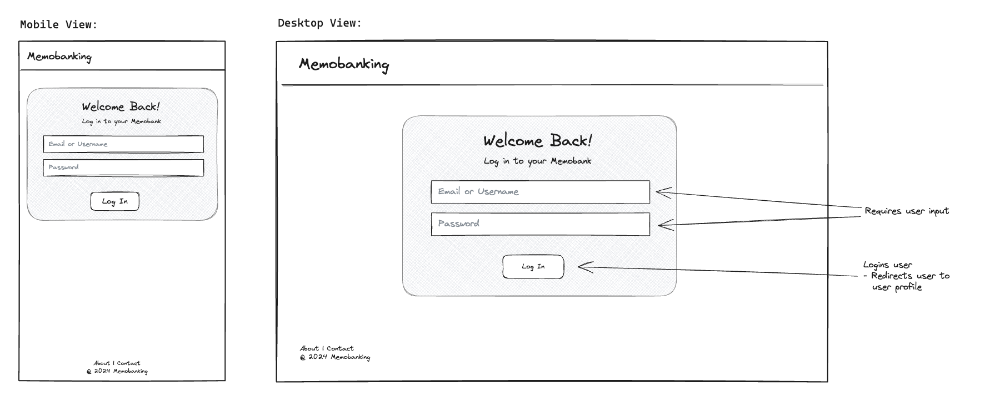

**External Pages: About/Contact**

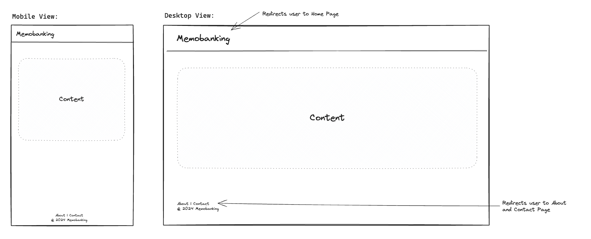

**User Profile Page:**

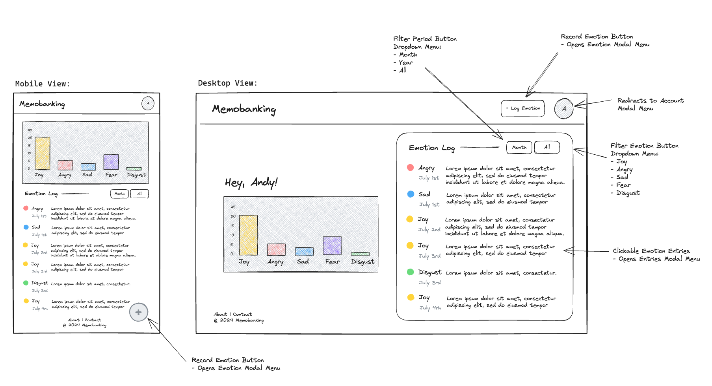

**Emotion Modal Menu:**

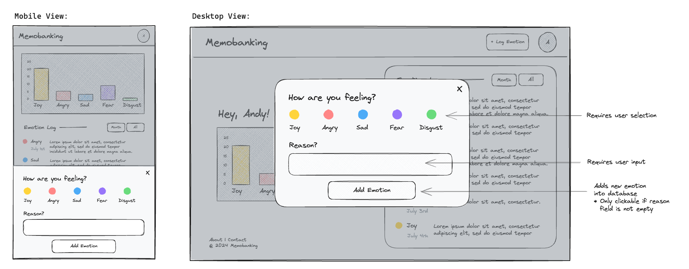

**Entries Modal Menu:**

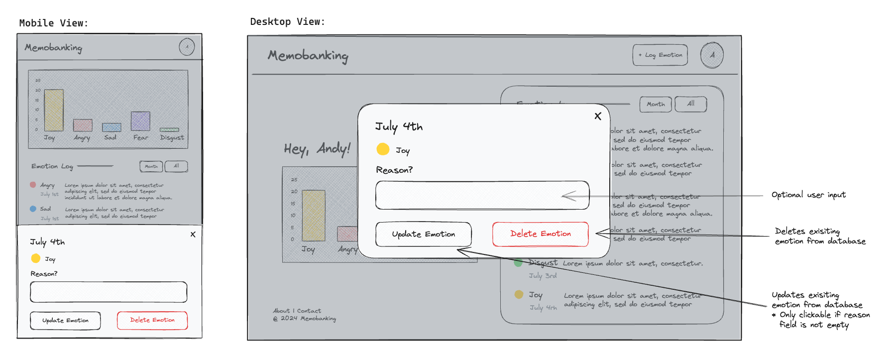

**Account Modal Menu:**

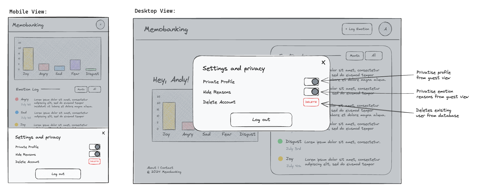

## 📚 Tech Stack

### **Frontend:**

| Services | Description |
| ------- | ----------- |
| [React](https://www.npmjs.com/package/react) | React is a powerful and widely adopted JavaScript library for building user interfaces. In this application, it used to create reusable UI components that can be easily integrated into application, improving efficiency and flexibility throughout the development process. |
| [React Router DOM](https://www.npmjs.com/package/react-router-dom) |  React Router DOM is flexible routing library for React apps. It allows developers to define routes and manage navigation within the app. In this application, React Router DOM was used to handle page routing, allowing users to navigate seamlessly across different pages within the application without reloading the entire page.
| [React Icons](https://www.npmjs.com/package/react-icons) | React Icons is a library that provides a collection of customisable icons for use in React applications. In this application, React Icons was used for certain buttons across the user interface to simplify development process |
| [Axios](https://www.npmjs.com/package/axios) | Axios is a promise-based HTTP client for making requests to remote servers. In this application, Axios was used to perform HTTP requests to fetch and send data between the frontend and backend API. |
| [Chart.js](https://www.npmjs.com/package/chart.js?activeTab=readme) | Text Here|

### **Backend:**

| Services | Description |
| ------- | ----------- |
| [Node.js](https://www.npmjs.com/package/node) | Node.js is runtime environment for executing sever-side code and manage operations using JavaScript outside the browser. In this application, Node.js was used to write server-side logic, scripts, and install a wide range of libraries through npm, improving efficiency and flexibility throughout the development process.cumbersome compared to traditional backend technologies.|
| [Express.js](https://www.npmjs.com/package/express) | Express.js is a web application framework for Node.js that simplifies the process of building RESTful API services. In this application, Express.js was used to set up the server, define route handlers, manage routing, and handle middleware. |
| [MongoDB Atlas](https://www.mongodb.com/products/platform/atlas-database) | MongoDB Atlas is a database service that provides a scalable and cloud-based MongoDB database. It allows developers to create applications that can store, query and manage data in a non-relational (noSQL) format. In this application,  MongoDB Atlas was used to handle large volumes of data, performing operations such as create, read, update, and delete (CRUD) on NoSQL documents. It is connected to Mongoose in the application's backend to enable efficient interaction with the MongoDB Atlas database.|
| [Mongoose](https://www.npmjs.com/package/mongoose) | Mongoose is an Object Data Modeling (ODM) tool designed to interact with MongoDB databases using Javascript. It simplifies data validation, querying, and relationships between data models without the need to write raw NoSQL queries. In this application, Mongoose was used to define schemas and models to structure and manage data in MongoDB. Furthermore, Mongoose queries were used to within the application's routes to query for user and emotion documents and create CRUD operations.
| [Dotenv](https://www.npmjs.com/package/dotenv) | Dotenv provides a way to manage environment variables in a Node.js application. This library allows developers to keep sensitive data, such as JWT keys and database credentials, secure and organised. In this application, Dotenv was used to load environment variables for connecting to the MongoDB database and for creating and verifying JWT tokens, ensuring that sensitive information was not exposed in the codebase.
| [Cors](https://www.npmjs.com/package/cors) | CORS is a security feature implemented in web browsers to control cross-origin requests which help prevent unauthorised access to resources. In this application, CORS was configured to allow cross-origin requests from anywhere without restrictions. While this approach is less secure, it allowed me to focus on the application's development and functionality without being constrained by cross-origin issues.|
| [JSON Web Tokens](https://www.npmjs.com/package/jsonwebtoken) | JSON Web Tokens allows developers to add JSON Web Token (JWT) based authentication and authorisation to their application. JWT based authentication means it follows the RFC 7519 standard, which is an internet standard that defines a secure method for transmitting data between a client and a server using JSON format tokens. In this application, JWTs are used to authorize users during login and authenticate them before performing certain CRUD operations.
| [BcryptJS](https://www.npmjs.com/package/bcryptjsn) | BcryptJS allows developers to use Bcrypt hashing algorithm to securely store passwords in their database. Bcrypt is a popular cryptographic algorithm designed to hash passwords by converting them into a string of characters that are highly resistant to various password-cracking techniques, such as brute force, rainbow table, and dictionary attacks. It is available in many programming languages and frameworks. In this application, the Javascript version of Bcrypt was used to hash the user's password during registration. This makes the application more secure and protected against unauthorised access to user accounts. |

## 📝 Project Development Log

In this project, I have opted to use a Kanban workflow as my method of planning and tracking the development of my application. Each column represents a different phase of development. Cards flow from one column to the next as they progress towards completion. The workflow involves the following phases: Backlog, To-Do, In-Progress, Review and Completed.

### Part A

04-07-2024

**Trello Kanban:**
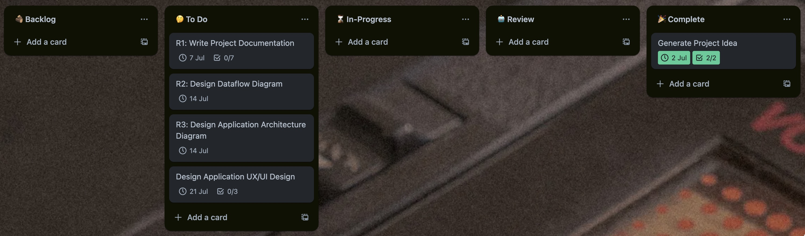

**Checklist: Generate Project Idea**

**Checklist: Write Project Documentation**

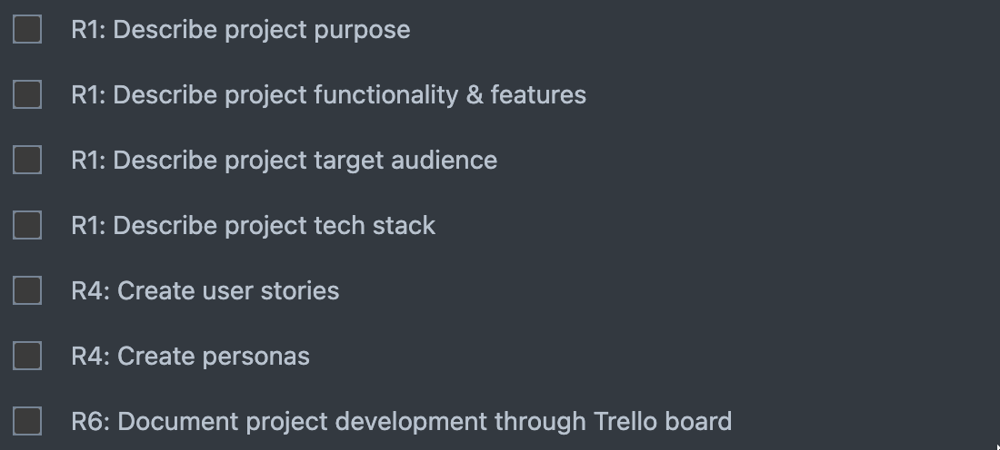

**Checklist: Design Application UX/UI Design**

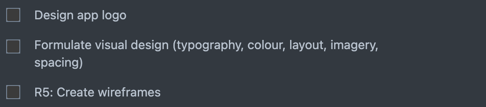

05-07-2024

**Trello Kanban:**
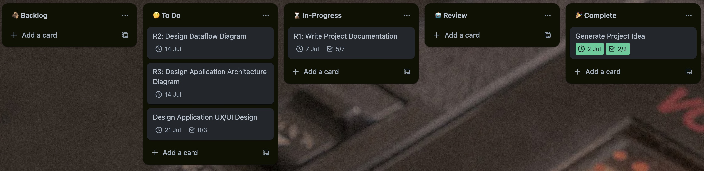

**Checklist: Write Project Documentation**

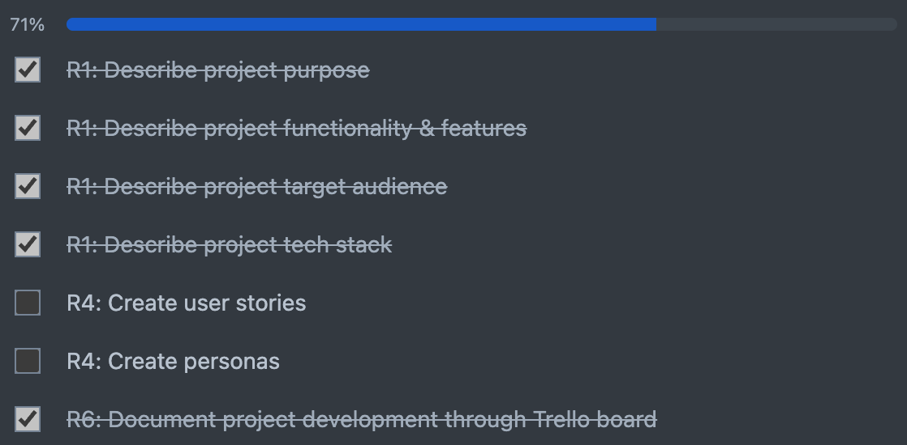

07-07-2024

**Trello Kanban:**
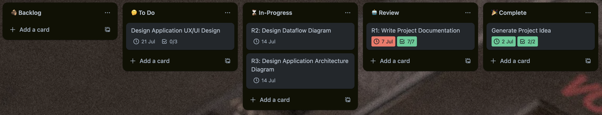

15-07-2024

**Trello Kanban:**
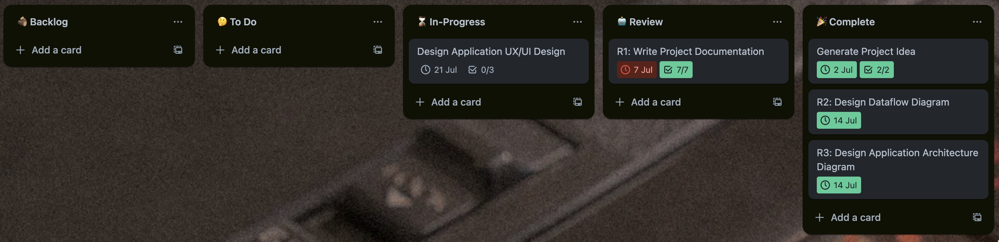

21-07-2024

**Trello Kanban:**
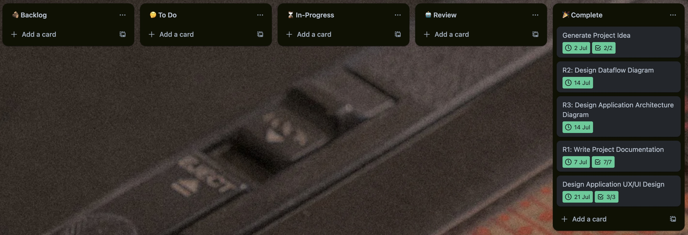

### Part B

26-07-2024

**Trello Kanban:**
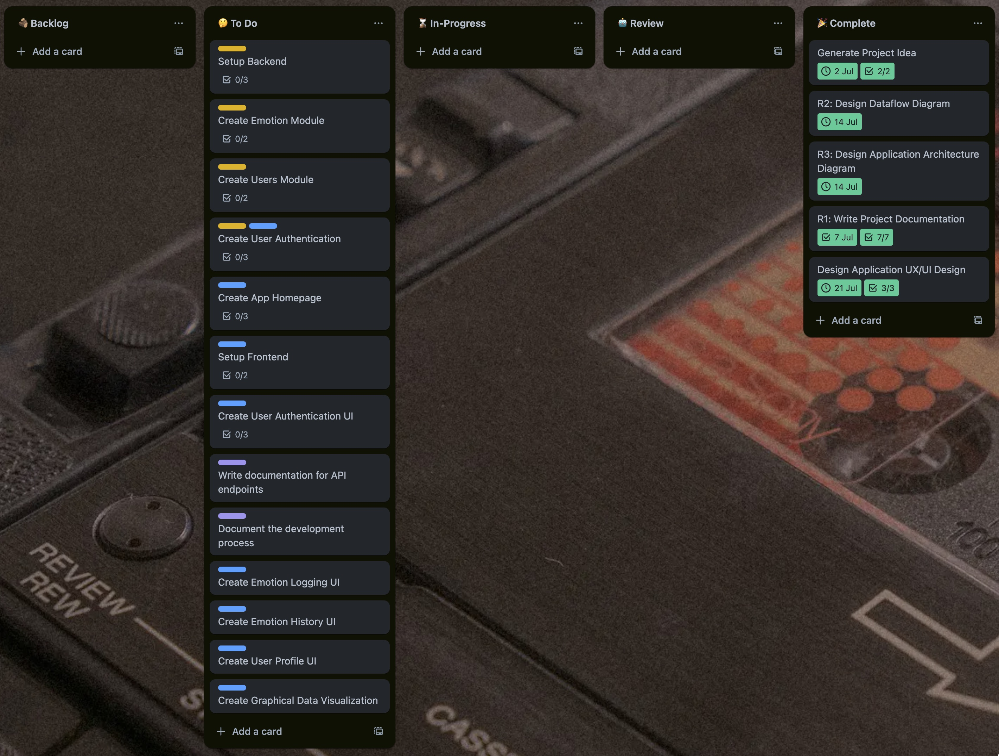

27-07-2024

**Trello Kanban:**
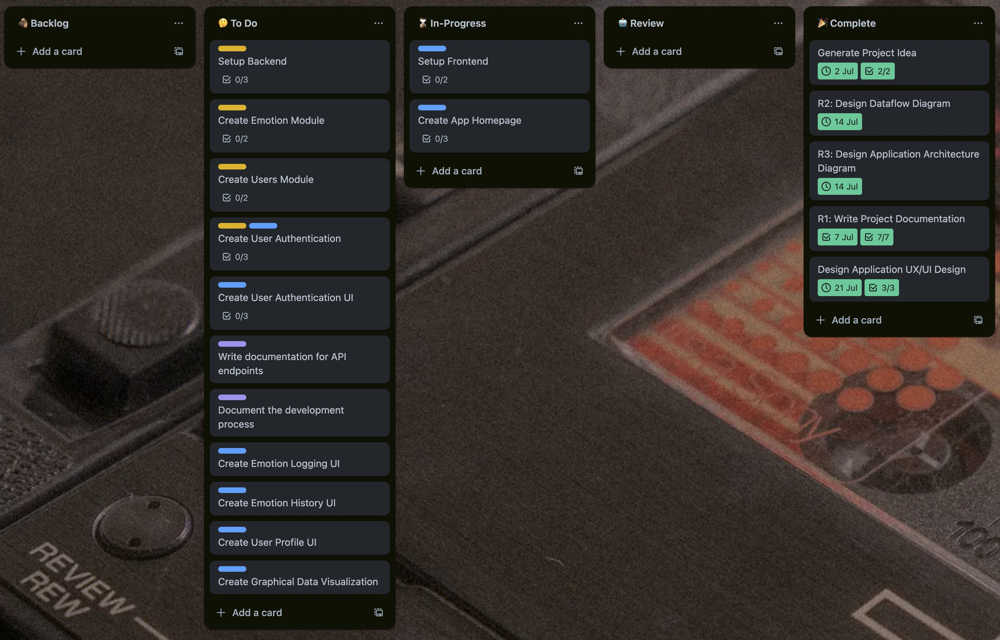

**Checklist: Setup Frontend**

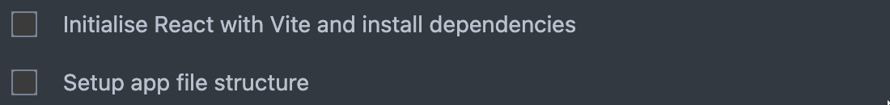

**Checklist: Create App Homepage**

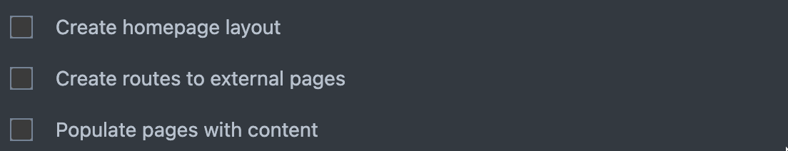

28-07-2024

**Trello Kanban:**
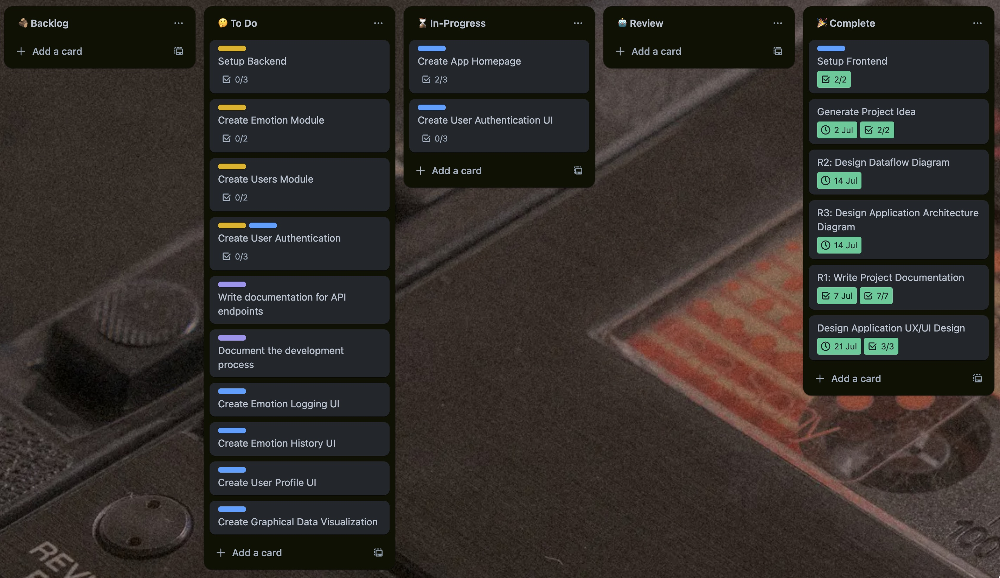

**Checklist: Create User Authentication UI**

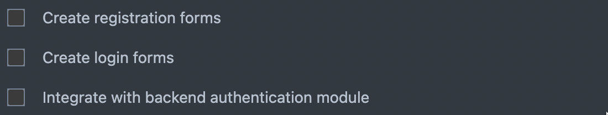

**Checklist: App Homepage**

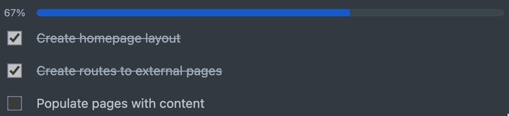

01-08-2024

**Trello Kanban:**
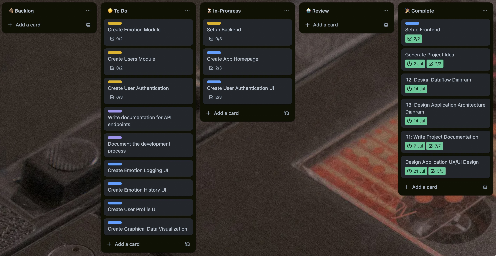

**Checklist: Setup Backend**

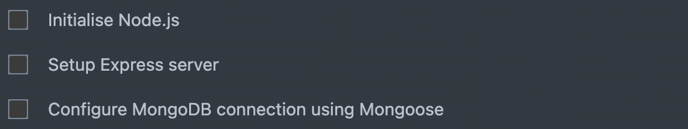

**Checklist: Create User Authentication UI**

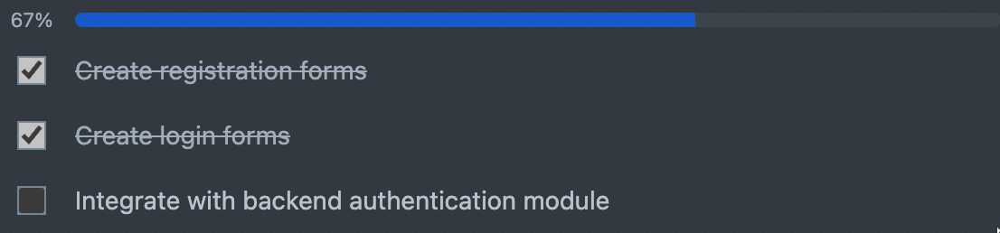

**Trello Kanban:**
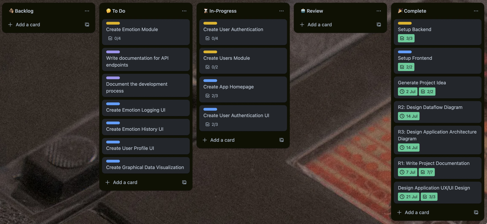

**Checklist: Create User Authentication**

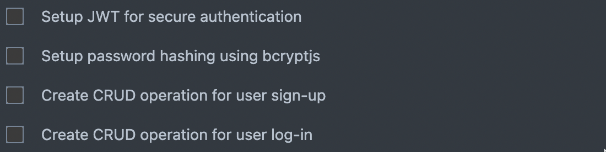

**Checklist: Create User Module Checklist**

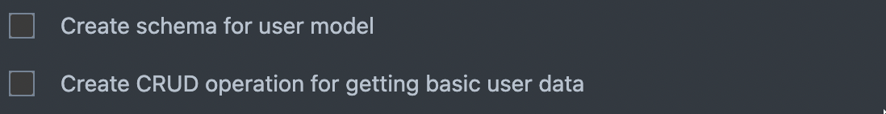

02-08-2024

**Trello Kanban:**
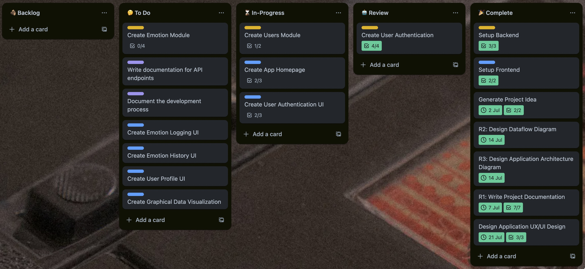

## 💎 Application Testing

### Development Testing

**DevTest.04-08-2024**
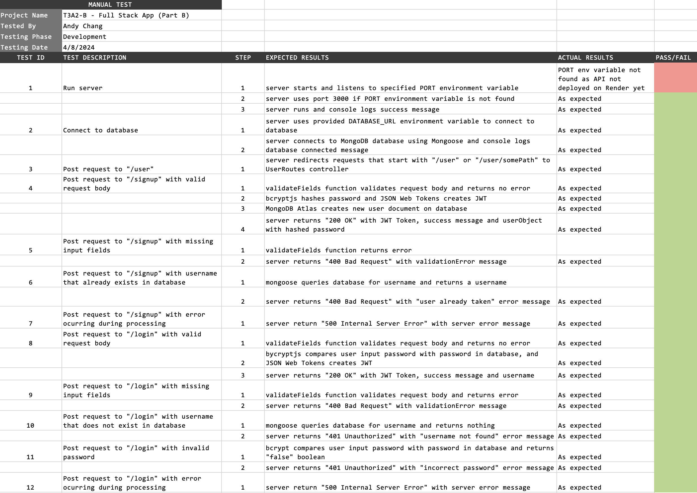

### Production Testing

**ProdTest.04-08-2024**
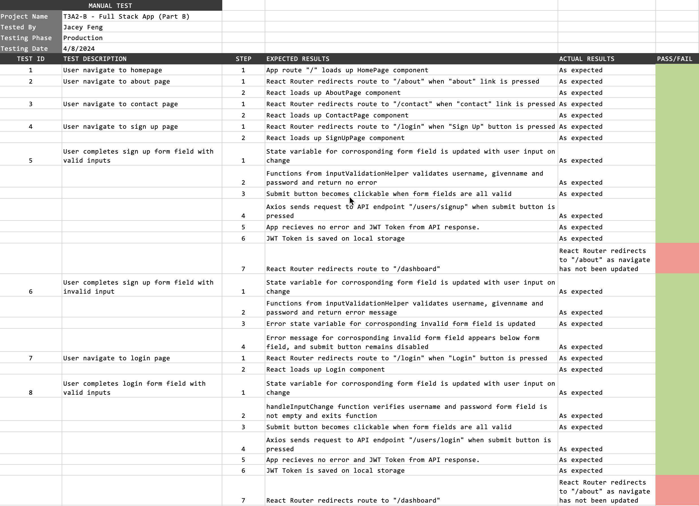