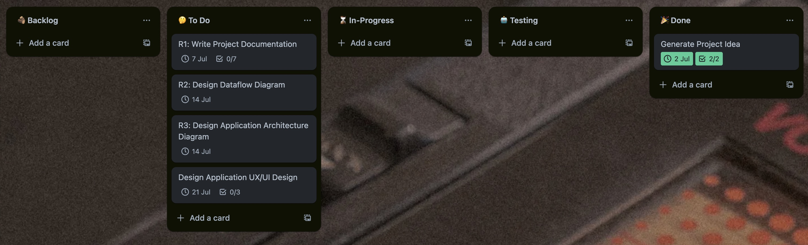
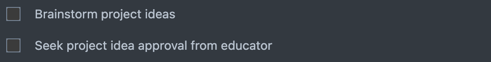
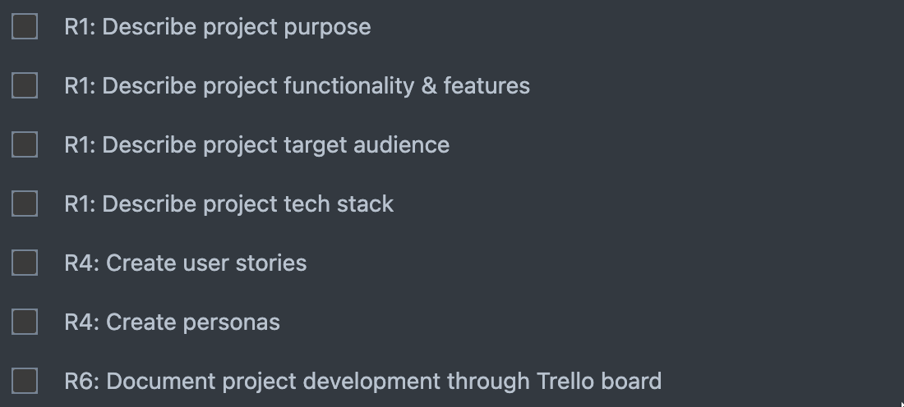
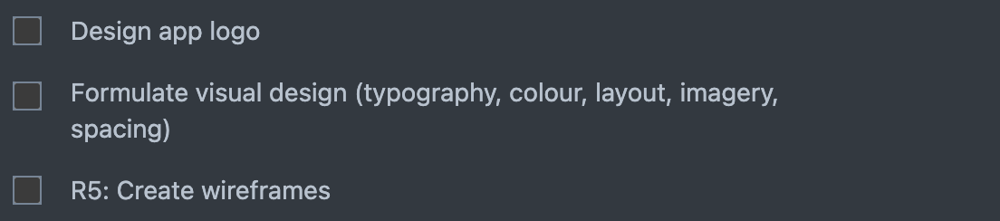

<h1 align="center"> Memobanking </h1>

  <a href="#💡-purpose">Purpose</a> •
  <a href="#⚙️-functionality">Functionality</a> •
  <a href="#-target-audience">Target Audience</a> •
  <a href="#-tech-stack">Target Audience</a> •
  <a href="#️-application-architecture-design">App Architecture Design</a> •
  <a href="#-dataflow-diagram">Dataflow Diagram</a> •
  <a href="#-project-development-log">Project Development Log</a> •

## 🚀 Purpose

Lorem ipsum dolor sit amet consectetur adipisicing elit. Vitae culpa ipsum aliquam, adipisci ratione distinctio eos voluptates nulla mollitia excepturi quas ipsam, vero temporibus a nisi asperiores illum optio beatae?

## ⚙️ Functionality

## 🎯 Target Audience

## 📚 Tech Stack

## 📡 Dataflow Diagram

## 🏛️ Application Architecture Design

## 🎨 Wireframes

## 📝 Project Development Log

In this project, I have opted to use a Kanban workflow as my method of planning and tracking the development of my application. Each column represents a different phase of development. Cards flow from one column to the next as they progress towards completion. The workflow involves the following phases: Backlog, To-Do, In-Progress, Testing and Done.

**10-03-2024:**

#### Generate Project Idea Checklist:

#### Write Project Documentation Checklist:

#### Design Application UX/UI Design Checklist:

