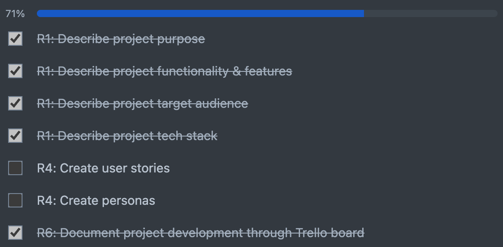
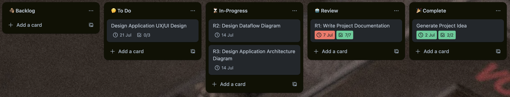
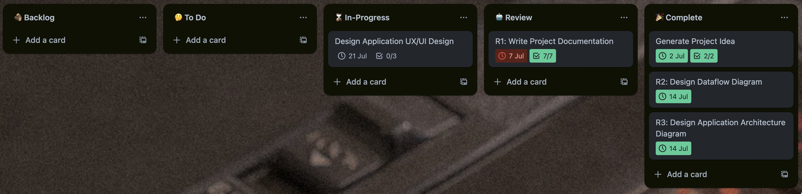

<h1 align="center"> Memobanking </h1>

  <a href="#💡-purpose">Purpose</a> •
  <a href="#⚙️-functionality">Functionality</a> •
  <a href="#-target-audience">Target Audience</a> •
  <a href="#-tech-stack">Tech Stack</a> •
  <a href="#️-application-architecture-design">App Architecture Design</a> •
  <a href="#-dataflow-diagram">Dataflow Diagram</a> •
  <a href="#-project-development-log">Project Development Log</a> •

## 🚀 Purpose

In today's fast-paced, digitalised world, mental health has become more crucial than ever. Young people, in particular, are facing unprecedented levels of stress, anxiety, and depression. The pressures of social media, academic demands, and societal expectations have contributed to a growing mental health crisis among the youth. 

By providing a structured way to track and understand emotions, Memobanking aims to be a proactive platform in addressing these issues. It encourages self-awareness and emotional regulation, key components in maintaining mental health and preventing the escalation of mental illnesses. Whether for personal growth or mental health management, Memobanking offers users valuable tools to navigate and understand one’s emotional landscape.  Through personalised insights and the ability to share experiences, Memobanking not only aids individual users but also fosters a broader conversation about mental health, promoting understanding and support within the community.

## ⚙️ Functionality

1. **Emotion Logging**
    
    Users can log their emotions by selecting from categories like Joy, Anger, Sadness, Fear, and Disgust. They have the option to write a brief note or reason for their emotion.

2. **Emotion History Log**
    
    Users can reflect back on their past emotion entries through a history log. Their emotion enteries can be categorised and filtered by date and emotion type for easy tracking and analysis.

3. **Graphical Data Visualisation**
    
    Users can track their emotional trends over time using graphs, identifying patterns and fluctuations.

4. **User Profiles**

    Users can choose to share their emotion history log and graphs publicly. They have options to control over what information is shared, such as hiding or showing reasons behind their emotions.
 

## 🎯 Target Audience

1. **Individuals with Mental Health Concerns**

    People dealing with anxiety, depression, or other mental health issues would find the app valuable for understanding their emotion patterns and indentifying potential triggers. 

2. **Therapy Clients**

    People who are already seeing therapists or counselors can use the app to track their progress and share data with their mental health professionals.

2. **Social Media Users**

    People who are active on social media might enjoy the feature that allows them to share their emotional data publicly, adding a personal and reflective aspect to their online presence.

### Personas & User Stories

## 📚 Tech Stack

**Frontend:**
  - **Framework:** React.js
  - **Libraries:** [Chart.js](https://www.npmjs.com/package/chart.js?activeTab=readme)

**Backend:**
  - **Framework:** Node.js with Express.js
  - **Libraries:** [Dotenv](https://www.npmjs.com/package/dotenv), [BcryptJS](https://www.npmjs.com/package/bcryptjsn), [JSON Web Tokens](https://www.npmjs.com/package/jsonwebtoken), [Axios](https://www.npmjs.com/package/axios)
  - **Database:** MongoDB

## 🏛️ Application Architecture Design

## 📡 Dataflow Diagram

## 🎨 Wireframes

**Sitemap:**

**Homepage:**

**Sign Up Page:**

**Login Up Page:**

**External Pages: About/Contact**

**User Profile Page:**

**Emotion Modal Menu:**

**Entries Modal Menu:**

**Account Modal Menu:**

## 📝 Project Development Log

In this project, I have opted to use a Kanban workflow as my method of planning and tracking the development of my application. Each column represents a different phase of development. Cards flow from one column to the next as they progress towards completion. The workflow involves the following phases: Backlog, To-Do, In-Progress, Review and Completed.

#### 04-07-2024:

**Generate Project Idea Checklist:**

**Write Project Documentation Checklist:**

**Design Application UX/UI Design Checklist**

#### 05-07-2024:

**Write Project Documentation Checklist:**

#### 07-07-2024:

#### 15-07-2024:

